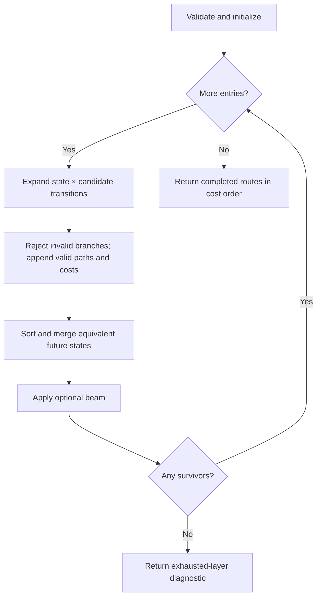

# Flight plan v2 constraint solver: comparison baseline

This document describes the current implementation as a baseline for comparing
backtracking, memoized search, shortest-path formulations, and other approaches.
It records implemented behavior, the assumptions behind its guarantees, and a
repeatable evaluation protocol. Proposed alternatives and benchmark metrics are
identified separately from behavior already implemented.

## 1. Baseline and scope

Snapshot date: **2026-09-30**. Repository base commit:
`6ce80be2d765b883397e771520cffc5707076e2f` (`refactor(route): candidate resolver`).
The solver and its subsequent readability refactor are working-tree changes on
top of that commit; checking out the base commit alone does not reproduce this
baseline.

The source fingerprint for all 12 Rust files below
`src/modules/flight/flight_plan/v2` is:

```text
f83cb5f3fa55df150960d69dab1bd8f2237b2187db3c8a824ca59b2c63b8af7a
```

To reproduce the fingerprint from the repository root:

```python
from pathlib import Path
import hashlib

root = Path("src/modules/flight/flight_plan/v2")
digest = hashlib.sha256()
for path in sorted(root.rglob("*.rs")):
    name = path.relative_to(root).as_posix().encode()
    digest.update(name + b"\0" + path.read_bytes() + b"\0")
print(digest.hexdigest())
```

The solver resolves ambiguous navigation interpretations and expands the route's
physical points. It does not calculate an aircraft trajectory, enforce flight
performance, or validate a complete operational flight profile.

## 2. Problem being solved

The preceding pipeline is:

```text
Route text → Lexer → LL(2) Parser → CandidateResolver → ConstraintSolver
```

The parser recognizes:

```text
route = dep ident* arr
dep   = IDENTIFIER SPEED_AND_ALTITUDE?
arr   = IDENTIFIER
ident = (IDENTIFIER | IDENTIFIER_REFERENCE | GEO) (VFR | IFR)? | DIRECT
```

The resolver produces a candidate list for each parsed entry. An identifier may
refer to several physical fixes, an airway, or procedures at different airports.
The solver chooses a sequence of interpretations whose connections are valid,
then ranks surviving sequences by a configurable cost.

The lexical requirement that departure and arrival be identifiers does **not**
require their resolved candidates to be airports. The solver accepts any valid
physical-point candidate at either endpoint. SID/STAR usage adds airport-specific
requirements.

### 2.1 Input contract

Input is `Vec<IdentWithCandidate<'s>>`, retaining route order. Each entry has:

- The original parsed identifier text.
- Point amendments: departure speed/altitude or an enroute VFR/IFR amendment.
- Parser diagnostics.
- All candidates returned by the resolver.

Candidate classes are:

| Class | Candidate variants | Solver interpretation |
|---|---|---|
| Physical point | Airport; enroute/terminal waypoint, VOR, NDB; Geo | Establish or connect to an actual point |
| Connection | Direct, Airway, Sid, Star | Store a pending connection or transition between airways |
| Unknown fallback | UnknownAirway, UnknownWaypoint | Reject the interpretation |

Plain identifiers always receive both unknown fallbacks from the resolver, even
when known candidates exist. Those fallbacks preserve unresolved possibilities
upstream; they do not permit a guessed connection through unknown data.

An identifier reference is resolved upstream by projecting each base fix's
coordinates using its heading and distance. It retains the base candidate's type
and scope. The solver uses the original reference text as the `NavPoint`
identifier and the projected coordinates as its position. It does not add a
special reference state or substitute the unprojected base point for connectivity
checks.

The solver rejects any input entry with parser errors before searching. However,
the resolver currently panics if a standalone amendment token reaches it. A
replacement solver cannot fix that upstream behavior merely by changing search.

## 3. Public API and outputs

| API | Navigation source | Result |
|---|---|---|
| `solve(self, &NavdataService).await` | Preloaded SQLite graphs | Cheapest surviving completed route |
| `solve_alternatives(self, &NavdataService).await` | Preloaded SQLite graphs | Distinct surviving completed final states, ordered by cost |
| `solve_with(self, &impl SolverNavdata)` | Supplied synchronous provider | Cheapest surviving completed route |
| `solve_alternatives_with(self, &impl SolverNavdata)` | Supplied synchronous provider | Distinct surviving completed final states, ordered by cost |

`ConstraintSolver::new(candidates)` uses default options. `with_options` replaces
them. All four solve methods consume the solver.

A typical in-crate call is:

```rust
let idents = Parser::new(Lexer::new(input).parse_all().collect())
    .parse()
    .collect();
let candidates = CandidateResolver::new(idents)
    .resolve_candidates(&navdata)
    .await?
    .collect();
let route = ConstraintSolver::new(candidates)
    .with_options(SolverOptions {
        beam_width: None,
        ..Default::default()
    })
    .solve(&navdata)
    .await?;
```

`ResolvedRoute` contains:

- `points`: explicit points and inserted expansion/intersection points.
- `legs`: logical connections between indices in `points`.
- `total_cost`: the accumulated scalar score.

Each `ResolvedPoint` carries its `NavPoint`, original amendments when explicit,
and a `PointSource`:

| Source | Meaning |
|---|---|
| `Explicit { token_index }` | Point selected from an input entry |
| `ImplicitAirwayIntersection { first_token, second_token }` | Junction inserted between consecutive airway entries |
| `AirwayExpansion { token_index }` | Intermediate point on a completed airway path |
| `ProcedureExpansion { token_index }` | Intermediate point on a completed SID/STAR path |

Indices called `token_index` refer to **parsed entries**, starting at zero. They
are not raw lexer-token indices: amendments have already been attached to entries.

A leg's `from` and `to` reference its logical endpoints. `expanded` contains the
intermediate point indices, excluding both endpoints. For example, an airway
path `[AAA, MID, FIX]` produces one logical leg from index 0 to index 2, with
`expanded = [1]`.

`Direct { token_index: Some(i) }` denotes an explicit DCT entry;
`Direct { token_index: None }` denotes an inferred direct connection.

“Alternatives” is deliberately narrower than all valid routes or the globally
best k histories. Equivalent histories have already been merged. Different
histories that reach the same final point with no pending connection yield only
the cheapest retained history for that final state.

## 4. Search state and equivalence

The internal immutable `State` has four fields:

```text
State = { points, legs, pending, cost }
```

The current point is the last recorded point. `pending` is either absent or a
`ResolvedConnection` waiting for its endpoint. It includes connection type,
identifier, procedure airport where relevant, and source entry index.

The initial state has no points, no legs, no pending connection, and zero cost.

Within a single parsed-entry layer, the equivalence key is:

```text
StateKey = (current PointKey, pending ResolvedConnection)
PointKey = (identifier, candidate type/scope, latitude bits, longitude bits)
```

Point coordinates use exact floating-point bit representations. Candidate scope
means the airport for airport/terminal candidates or ICAO region for enroute
candidates. Terminal and enroute types remain distinct. Identically spelled
fixes at different locations must not merge.

The layer index is implicit: merging only occurs among states that have consumed
the same number of entries. The remaining input, options, navigation provider,
and destination-airport candidate set are shared context.

History and amendments are not part of the key. This is valid for the current
model because future feasibility and incremental cost depend on the current
point, pending connection, next entries, and shared context. The cheaper of two
equivalent histories dominates the more expensive one.

This dominance assumption must be reconsidered if future rules depend on
previously used airways, visited points, a selected runway/transition, active
flight rules, altitude, or other historical information. Such information must
enter the state/key or merging can become unsound.

## 5. Algorithm

The outer algorithm is dynamic programming over parsed-entry layers with an
optional beam limit:

```text
validate syntax and options
load the route's navigation graphs, when using the SQLite entry point
states = [empty state]

for each parsed entry in route order:
    expanded = all valid transitions for each (state, candidate) pair
    discard states with nonfinite cost
    sort expanded states by accumulated cost
    merge equivalent future states, keeping the cheapest
    retain at most beam_width states, if a beam is configured
    if none survive:
        return a diagnostic for this exhausted layer
    states = survivors

return completed states, in cost order
```



Transitions preserve all valid branches until merging or beam pruning. A
navigation-provider error aborts the whole solve, even if another candidate
could have succeeded; a missing path rejects only that branch.

There are no mutable search variables. The outer loop is an immutable
`try_fold`; transitions construct new states. This preserves the earlier coding
preference, while also causing history-copying costs discussed below.

## 6. Hard constraints and transitions

Hard constraints control feasibility. No amount of cost improvement can make a
violating interpretation valid.

### 6.1 Physical points

All point coordinates must be finite, with latitude in `[-90, 90]` and longitude
in `[-180, 180]`.

The first selected point initializes the route. For a later point:

| Pending connection | Required behavior |
|---|---|
| None | Infer a direct leg from the current point |
| Direct | Complete the explicit direct leg |
| Airway | Obtain a directed continuous airway path between the actual points |
| Sid | Obtain a published SID path from the current airport to the point |
| Star | Require the point to be the STAR's airport and obtain a published path to it |

A successful connection appends intermediate expansion points, appends the new
endpoint and logical leg, adds cost, and clears the pending connection.

An ordinary terminal fix's airport scope is metadata, not a requirement that its
airport be the route's departure or destination. For example, `DEP FIX ARR` can
use a terminal FIX belonging to a third airport. Airport matching is enforced
specifically for procedure interpretations.

### 6.2 Connection entries

The first and last entries must resolve as physical points. An entry carrying an
amendment must also resolve as a point, even if its spelling matches an airway or
procedure.

| Candidate | Preconditions | State change |
|---|---|---|
| Direct | No pending connection | Store an explicit Direct connection |
| Airway, with no pending connection | Current physical point belongs to the airway | Store the airway as pending |
| Airway, following another airway | Reachable physical intersection(s) exist | Complete the previous airway to each junction; store the next airway as pending |
| Sid | Entry index 1; no pending connection; current point is its airport | Store the SID as pending |
| Star | Penultimate entry; no pending connection; its airport is among final-entry airport candidates | Store the STAR as pending |
| Unknown candidate | Never accepted | No successor |

Connection combinations outside these cases are rejected. In particular,
`DCT DCT`, an airway followed by DCT before a point, and a SID/STAR following an
uncompleted connection have no valid transition. An explicit point is needed to
complete the preceding connection, except for the airway-to-airway junction case.

### 6.3 Consecutive airways

For `AAA J1 J2 END`, the J2 entry does not immediately reach END. It:

1. Finds physical intersections between J1 and J2.
2. Requests a J1 path from the current AAA candidate to each intersection.
3. Creates a state for each reachable junction and completes its J1 leg.
4. Attaches the implicit-intersection penalty.
5. Leaves J2 pending at that junction.

The following END entry then requires a J2 path. A shared point can be an
intersection yet fail to reach END in the required direction; that branch is
rejected at END.

## 7. Cost model

All weights must be finite and nonnegative. Defaults are:

```text
implicit_direct       = 1.0
implicit_intersection = 1.0
distance_weight       = 1.0
beam_width            = Some(64)
```

Each completed logical leg contributes:

```text
leg_cost = interpretation_penalty
         + distance_weight × (path_distance_nm / 500)²

route_cost = sum(leg_cost)
```

The interpretation penalty is the implicit-direct weight for an inferred DCT,
the implicit-intersection weight when finishing an airway at an inferred
junction, and zero otherwise. Merely opening a pending connection adds no cost.
There is no additional SID/STAR preference or unknown-candidate penalty; unknowns
are infeasible.

Path distance sums great-circle distances over every edge in the returned path,
including expansion points. The implementation uses the haversine formula with
mean Earth radius 6,371,008.8 metres and 1 NM = 1,852 metres. Its distance
calculation handles travel across the antimeridian.

The square is applied **after summing a logical leg's distance**, not separately
to each physical edge. A 300 NM airway leg contributes `0.36`, whether it is one
edge or several intermediate edges totaling 300 NM. Two logical 150 NM legs
contribute `0.09 + 0.09 = 0.18`, before interpretation penalties. Thus the objective
depends on logical segmentation as well as physical distance. Comparisons must
preserve this definition or explicitly report an objective change.

For a hypothetical 100 NM connection with defaults:

| Input | Distance contribution | Interpretation penalty | Total |
|---|---:|---:|---:|
| `AAA DCT END` | 0.04 | 0 | 0.04 |
| `AAA END` | 0.04 | 1 | 1.04 |

Costs are interpretation-ranking scores, not fuel, time, or probability.

## 8. Navigation model

### 8.1 Provider boundary

`SolverNavdata` exposes synchronous operations:

```text
airway_contains(airway, point) -> bool
airway_path(airway, from, to) -> optional inclusive path
airway_intersections(first, second) -> points
procedure_path(kind, airport, procedure, from, to) -> optional inclusive path
```

Paths include both endpoints in flight order. Providers are responsible for
physical identity, continuity, direction, and valid path points. The search
trusts the supplied paths; it does not independently revalidate every intermediate
point or direction returned by a custom provider.

For equivalent-state dominance and repeatable comparisons, a provider should
return deterministic results for identical queries during a solve. Graph
mutation or history-dependent provider behavior violates the shared-context
assumptions.

### 8.2 SQLite loading

The asynchronous API loads each distinct referenced airway and each distinct
`(SID/STAR kind, airport, procedure identifier)` graph once per solve. It loads
graphs for candidate interpretations before knowing whether they will survive.
Loading errors abort the solve. There is no database I/O during the state search.

This is graph caching, not path-result caching. Repeated path and intersection
queries can still repeat graph computations. Graphs are not cached across
separate solver calls.

### 8.3 Airway graphs

Airway records come from `tbl_er_enroute_airways`, ordered by `area_code, seqno`.
Adjacent records produce edges only when their area codes match and the previous
record's second description character is not `E` (an end marker).

The direction restriction of the destination record controls an adjacent pair:

| Value | Edge direction |
|---|---|
| `F` | Earlier record → later record |
| `B` | Later record → earlier record |
| Other/empty | Both directions |

Supported airway reference tables are `EA` (enroute waypoint), `D` (VOR), and
`DB` (enroute NDB). Unsupported references or invalid coordinates are navigation
errors rather than unknown candidates.

### 8.4 Procedure graphs

`NavdataService::list_procedure_segments` groups fixed endpoints by route type
and transition identifier in sequence order. Each fixed-point chain contributes
directed adjacent edges. Shared physical points allow chains to connect.

Without a selected runway, the adapter retains all published runway branches.
SID runway types are `1`/`4`; STAR runway types are `3`/`6`. When no nonempty runway
branch is available, the adapter uses common-route types `2`/`5` for its airport
connectors. It adds an edge from the airport to a SID branch's first point, or
from a STAR branch's last point to the airport.

The service drops records without a fixed endpoint, such as vector/altitude
terminations. Adjacent retained fixes are then connected. This represents
fixed-point topology, not full leg geometry or complete procedure semantics.
Runway/transition selection is not a search-state dimension, and the graph can
connect chains through shared physical points without retaining a selected
transition identity.

### 8.5 Graph path search and physical matching

The adapter uses an immutable Dijkstra-style search with nonnegative geographic
edge lengths. It keeps a sorted vector frontier, visits node keys, and retains
the shortest frontier history per exact endpoint key. It scans the edge list
for outgoing edges. It is not a binary-heap/adjacency-list implementation.

Each path query returns one geographically shortest path under the adapter's
graph model, rather than enumerating all graph paths. The outer solver branches
over candidate endpoints and junctions, not over every possible path geometry.

Graph matching (`same_fix`) differs from the exact DP point key:

- Identifiers must match.
- Candidate families must match: airport, waypoint, VOR, NDB, or Geo.
- If both candidates have enroute ICAO scopes, those scopes must match.
- Each coordinate must differ by at most `1 / 3600` degree.
- Terminal and enroute forms of the same family can match; terminal airport scope
  is not separately compared by this matching function.

This tolerance accommodates small differences between fix and route tables. It
is an implementation policy, not a universal point-identity standard. It is not
a transitive equivalence relation, and exact state keys still distinguish small
coordinate differences. Longitude matching uses absolute differences, so
`-180` and `180` do not match even though geographic distance wraps correctly.

Identical matching endpoints return a two-endpoint zero-distance path when the
coordinates are identical. The returned path substitutes the requested endpoint
representations at its ends; internal points come from the graph.

## 9. Worked search examples

All short names below are synthetic fixture names, not claims about published
navigation data.

### 9.1 Connectivity beats proximity

Input: `AAA J1 FIX END`. FIX has two candidates: a nearby fix not reachable on J1
and a farther fix on J1. The available airway path is `[AAA, MID, FIX_far]`.

| Entry processed | State/result |
|---|---|
| AAA | Current AAA; no pending connection; cost 0 |
| J1 | Current AAA; pending J1 |
| FIX | Reject FIX_near; append MID and FIX_far via J1; clear pending; add leg cost |
| END | Append an implicit direct leg to END and its penalty |

MID has `AirwayExpansion` provenance, and FIX_far is explicit. A smaller distance
cannot rescue FIX_near because reachability is a hard constraint.

### 9.2 A junction can fail later

Input: `AAA J1 J2 END`. Both BAD and JOIN are shared points reachable from AAA
along J1. Only JOIN can reach END along J2.

```text
                        BAD  -- J2 --> no path to END
AAA -- pending J1 --> <
                        JOIN -- J2 --> END
```

At J2, both branches can survive. At END, BAD is rejected. The result has two
logical airway legs and an implicit JOIN point with both source airway indices.

### 9.3 Dominance removes redundant histories

Input: `AAA FIX END`. Two different starting AAA candidates reach the same exact
FIX. Their accumulated costs at FIX are 3 and 8, and both have no pending
connection. Their future choices and incremental costs are identical, so only
the cost-3 history is retained. Even `solve_alternatives` will not return the
dominated history.

### 9.4 A narrow beam can discard the only solution

Input: `AAA FIX J1 END`. FIX_near gives a cheap prefix but is not on J1.
FIX_far gives a more expensive prefix and is the only candidate that can reach
END via J1.

With a beam of 1, FIX_far can be discarded while processing FIX, and the solve
fails at J1. With the beam disabled, both states survive until J1 and the valid
FIX_far interpretation completes. Ordering candidates by proximity and returning
the first branch would have a related failure unless backtracking revisits it.

### 9.5 Preserve annotations without profile search

Input: `DEP K0830M0840 FIX VFR DCT ARR`.

The parsed departure carries speed/altitude; FIX carries VFR. The solver resolves
DEP, FIX, and ARR, preserves those amendments, infers DEP→FIX, and records the
explicit FIX→ARR DCT. It does not simulate when a flight-rule change takes effect,
calculate climb/descent, or apply altitude constraints to the airway graph.

## 10. Guarantees and limitations

### 10.1 Exact mode

With `beam_width: None`, the outer DP preserves all distinct reachable future
states and their cheapest histories. Under the stated state-sufficiency,
deterministic-provider, additive-cost, and finite-cost assumptions, it returns a
minimum-cost completed interpretation in the supplied candidate/transition model.

This does not mean exhaustive operational flight planning. Exactness is bounded
by the candidates provided, the adapter's graph construction and matching policy,
the single path supplied per endpoint query, and the absence of profile or
runway-selection constraints. It does not enumerate every valid history.

### 10.2 Beam mode

With `Some(K)`, the search retains at most K states after each layer's expansion
and merging. It remains constrained, but is approximate: it can miss the cheapest
route, or every viable route. A beam-mode exhausted-layer error is not proof that
the full candidate model is infeasible.

The beam caps surviving states, not the transient expanded layer. All valid
successors are materialized before pruning, so a large junction set can still
create substantial temporary memory and work.

### 10.3 Output and numerical boundaries

- Empty input returns one empty completed route with cost 0 and performs no graph
  queries. The parser marks a nonempty missing-arrival route as invalid.
- Costs use `f64`. States with nonfinite accumulated cost are silently removed by
  pruning. Very large finite weights can therefore overflow and lead to an
  exhausted-layer diagnostic, rather than a specific numerical error.
- Equal-cost routes have no explicit semantic tie-break rule. Equivalent ties
  retain the first encountered history; do not assume reproducible ordering
  across changed candidate or graph construction orders.
- Amendments do not constrain future feasibility. Unknowns never succeed.
- Intermediate points and paths from custom providers are trusted.
- No aircraft performance, airway altitude limits, time-dependent restrictions,
  runway choice, full procedure-leg geometry, or profile replay are implemented.

## 11. Errors and diagnostics

| Error | Trigger |
|---|---|
| `InvalidOptions` | Beam width zero, or any negative/nonfinite cost weight |
| `InvalidSyntax` | First parsed entry carrying parser diagnostics |
| `Navdata` | Database, conversion, graph-loading, or provider failure |
| `UnknownIdentifier` | An exhausted entry has no known candidates, including an empty candidate list |
| `NoValidTransition` | Known candidates exist, but none produce a surviving state |
| `IncompleteRoute` | No final state has cleared its pending connection |

For `NoValidTransition`, diagnostics are recomputed only for the exhausted layer,
using the prior surviving states and known candidates. Duplicate violations are
removed. Viable layers retain no rejected-branch explanation history.

Violation categories cover invalid endpoint/annotation roles, invalid coordinates,
airway entrance membership, missing directed paths, missing connecting
intersections, procedure airport mismatch/path failure, and invalid connection
sequences. They summarize the cause inferred from a rejected state/candidate pair.
They are not complete proofs, minimal unsatisfiable cores, or precise provenance
for every rejected branch. For example, a rejected STAR endpoint can be reported
as a procedure-path failure even when the mismatch is at that endpoint.

## 12. Implementation map and computational costs

All paths in this table are relative to this repository.

| Source | Responsibility |
|---|---|
| [constraint_solver.rs](../src/modules/flight/flight_plan/v2/constraint_solver.rs) | Public entry points, input validation, layer expansion, orchestration, final routes |
| [transitions.rs](../src/modules/flight/flight_plan/v2/constraint_solver/transitions.rs) | Point/connection transitions and hard constraints |
| [state.rs](../src/modules/flight/flight_plan/v2/constraint_solver/state.rs) | Immutable history extension, scoring, future-state deduplication and beam pruning |
| [point.rs](../src/modules/flight/flight_plan/v2/constraint_solver/point.rs) | Position validation, exact point keys, geographic distance |
| [types.rs](../src/modules/flight/flight_plan/v2/constraint_solver/types.rs) | Results, options, errors, provider contract |
| [diagnostics.rs](../src/modules/flight/flight_plan/v2/constraint_solver/diagnostics.rs) | Exhausted-layer summaries |
| [navdata.rs](../src/modules/flight/flight_plan/v2/constraint_solver/navdata.rs) | SQLite graph loading, tolerant matching, graph path search |
| [tests.rs](../src/modules/flight/flight_plan/v2/constraint_solver/tests.rs) | Search behavior and SQLite integration fixtures |
| [expansion.rs](../src/modules/navdata/service/expansion.rs) | Conversion of procedure records into fixed-point segments |

Let `S_i` be prior surviving states, `C_i` candidate count, and `E_i` the number
of valid successor states materialized for layer i. Ordinary expansion considers
`S_i × C_i` pairs; consecutive airways can produce several successors per pair.
Navigation queries and copying are additional costs.

Sorting costs approximately `O(E_i log E_i)` comparisons. Deduplication uses
hash keys after sorting; hashing includes identifier/scope strings. Beam mode
bounds `S_i` by K after pruning, but does not independently bound `E_i`.

The implementation stores complete point/leg histories in every state and clones
them when branching or extending. If a typical history has H elements, survivor
storage is on the order of `K × H` in beam mode, plus preloaded graphs and the
expanded layer. Exact mode substitutes the full distinct-state count for K.
These are structural estimates, not measurements.

The adapter scans graph edges during path expansion, sorts a vector frontier,
clones path histories and visited sets, and does not memoize path results. Airway
intersection matching compares points across both graphs. Standard binary-heap
Dijkstra complexity should not be quoted as the current adapter's measured or
implemented complexity.

Outer state merging often reduces repeated future work compared with exhaustive
history enumeration, but no universal small-state or latency bound is claimed.

## 13. Existing verification

The last recorded check for this snapshot was:

```sh
cargo test modules::flight::flight_plan::v2:: --offline
```

It passed **52 v2 tests**, including **15 solver tests and 6 navigation-adapter
tests**. Formatting and `git diff --check` also passed during the implementation
refactor. This document introduces no solver behavior changes.

| Covered behavior | Representative test |
|---|---|
| Explicit/implicit DCT, costs, amendments | `explicit_and_implicit_direct_preserve_annotations_and_cost` |
| Connectivity overrides nearer candidate; expansion indices | `airway_connectivity_overrules_nearest_candidate_and_preserves_expansion` |
| Junction branching followed by later rejection | `implicit_intersection_branches_are_validated_by_the_following_airway` |
| Unknowns, disconnected paths, invalid connection roles | `fails_for_disconnected_paths_intersections_unknowns_and_invalid_roles` |
| Cheapest equivalent future only | `deduplication_keeps_the_cheapest_equivalent_future` |
| Beam can lose the only feasible prefix | `disabled_beam_retains_a_costlier_prefix_needed_for_a_later_constraint` |
| Third-airport terminal fix remains usable | `terminal_fix_scope_does_not_restrict_route_endpoints` |
| Procedure airport matching and published paths | `sid_and_star_require_the_correct_endpoint_airports_and_published_paths` |
| Syntax/options/coordinates/empty input | `validates_syntax_configuration_and_coordinates_and_accepts_empty_input` |
| Antimeridian distance | `distance_cost_handles_the_antimeridian` |
| Ordered distinct final states | `distinct_final_states_are_returned_in_cost_order` |
| Exhausted-layer explanation | `exhausted_layer_explains_the_failed_airway_constraint` |
| Published direction, gaps, branches, cycles, point identity | Navigation-adapter unit tests |
| Real SQLite graph loading and expansions | `sqlite_pipeline_expands_airways_and_preserves_source_annotations`, `sqlite_procedure_adapter_connects_published_sid_and_star_sequences` |
| Database error propagation | `sqlite_load_errors_propagate_and_empty_input_does_not_query` |

SQLite integration uses `data/ng_jeppesen_fwdfd_2401.s3db` and
`assets/test/routes.csv`. The airway pipeline fixture manually supplies a MACKI
point candidate because that reduced database stores it only in an airway table,
not a fix table. Therefore the fixture verifies solver integration but does not
establish that the unmodified resolver finds every airway point in incomplete
navigation data.

There are no recorded latency, allocation, memory, or large-corpus benchmarks.
Passing tests establishes the checked behaviors, not universal completeness or
performance.

## 14. Comparing alternative approaches

Separate a **search-engine comparison** from changes to candidate resolution,
navigation modeling, cost semantics, or output requirements. Otherwise a change
in results may come from a different problem definition rather than a better
search algorithm.

### 14.1 Expected tradeoffs, not benchmark results

| Approach | Result policy | Potential benefit | Cost or condition to evaluate |
|---|---|---|---|
| Current DP, no beam | Cheapest history per distinct completed final state | Reuses equivalent futures; retains exact outer-model feasibility | Can retain many distinct states; clones histories; adapter query costs remain |
| Current DP, beam K | Cheapest among retained states | Limits survivor count and subsequent expansion | May lose optimality or feasibility; transient branching is still uncapped |
| DFS backtracking, first success | Any feasible history | Small driver; can stop early | Candidate order affects result; does not preserve minimum-cost semantics |
| Exhaustive DFS, best result | Cheapest complete history under the same model | Direct recursive control flow | Can repeat equivalent futures and enumerate exponentially many histories |
| Memoized DFS | Best result/suffix per sufficient state key | Reuses subproblems with recursive organization | Requires equivalent state semantics, correct history reconstruction, and explicit alternative policy |
| Branch-and-bound | Best complete history | Can prune prefixes using an incumbent solution and lower bound | Bound quality matters; incumbent/state threading adds complexity; correctness requires admissible bounds |
| Uniform-cost or A* search over interpretation states | Cheapest complete state | Expands promising states first; supports global priority ordering | Requires a priority frontier; A* needs an admissible heuristic; candidate branching and graph modeling remain |

The current costs are nonnegative, so accumulated prefix cost is a valid lower
bound for branch-and-bound. It may be weak because opening a connection adds no
cost until an endpoint is selected. No A* heuristic or branch-and-bound pruning
is currently implemented.

Changing the search driver does not remove the hard-constraint transitions,
navigation graph conversion, procedure limitations, annotation handling, output
provenance, or diagnostic design. Evaluate readability on these components as
well as on the loop itself.

### 14.2 Fixed comparison contract

Before comparing implementations, record:

1. Source revision/fingerprint, compiler/build mode, machine, and navdata fixture
   checksum/version.
2. Identical parser output and ordered candidate lists, including unknowns and
   projected references.
3. Identical provider graph/path/matching policy, or a separately reported provider
   experiment.
4. Identical logical-leg cost formula and weights.
5. Required result policy: any route, cheapest route, distinct final states, or
   all/k-best histories. These policies are not interchangeable.
6. Whether approximation is permitted, including beam width, resource limits,
   timeouts, and how truncation is reported.
7. Expected error categories, provenance, and equal-cost tie handling.

For small synthetic cases, exhaustive enumeration with the same transitions and
provider is a useful independent search oracle. Compare exact DP against it
before using DP as the reference for larger cases. This is a proposed comparison
method; such an oracle is not currently implemented.

### 14.3 Evaluation corpus

Retain the existing fixtures and add controlled families covering:

- Increasing route length and candidate ambiguity per entry.
- Cheap dead ends that fail early versus at the last entry.
- Many histories converging to the same state versus mostly distinct states.
- Increasing airway-intersection counts and branching/cyclic graph topology.
- Directional reversals, segment gaps, repeated names in different regions, and
  coordinate-tolerance boundaries.
- SID/STAR airport mismatches, multiple runway branches, and shared transition
  points.
- Explicit versus implicit DCT, annotation preservation, and reference points.
- Empty/invalid inputs, unknown-only entries, malformed navdata, and DB errors.
- Ties, zero cost weights, extreme finite weights, and reproducible candidate-order
  permutations.

### 14.4 Metrics and reporting template

Measure candidate resolution, graph loading, and search separately, then report
end-to-end latency. The current search may make several graph queries per state
transition, so search and adapter work should also be distinguished where possible.

| Dimension | Report |
|---|---|
| Feasibility | Agreement with the exact oracle/reference; false infeasible results; invalid returned routes |
| Ranking | Cost difference from the exact optimum; disagreement rate; handling of ties |
| Alternatives | Number and meaning of results; dominated-history suppression; provenance agreement |
| Runtime | Median/p95/max by phase, with build settings and repeated-run protocol |
| Memory | Peak resident memory, allocations, peak expanded/survivor/frontier counts |
| Search work | State-candidate attempts, generated successors, merged states, beam/bound removals |
| Navigation work | Graph loads, path/intersection calls, explored nodes/edges, cache hit rates |
| Diagnostics | Correct entry index/category, retained explanation detail, approximation visibility |
| Readability | Driver and transition size, duplicated rules, state/key complexity, tracing a worked example |
| Extensibility | Effect of adding profile/runway/history constraints on state sufficiency and implementation |

Instrumentation for these metrics is a proposal, not an existing API. Do not
infer a performance win solely from fewer lines or a shorter recursive loop.

For each future alternative, retain a short result record:

```text
Approach and revision:
Shared parser/resolver/provider revisions:
Result policy and cost model:
Exactness/approximation/resource settings:
Corpus and fixture checksums:
Correctness and diagnostic differences:
Latency, memory, and work measurements:
Readability and extensibility observations:
Decision and remaining uncertainties:
```

An alternative preserves this baseline when it enforces the same constraints,
optimizes the same objective under the agreed result policy, preserves output
meaning, and states any changed completeness or resource guarantees explicitly.
